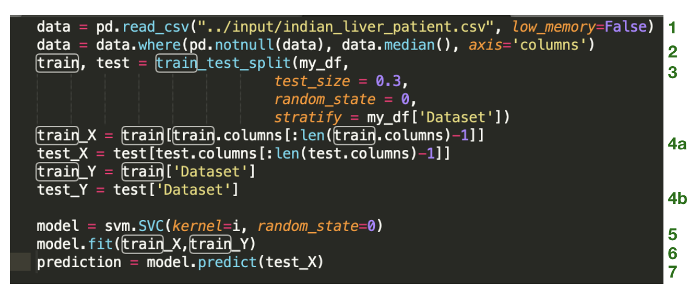
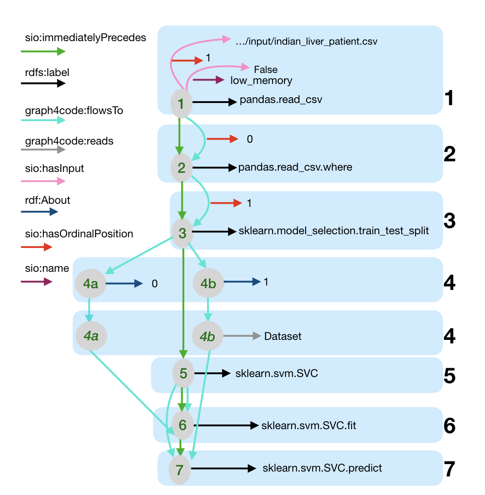
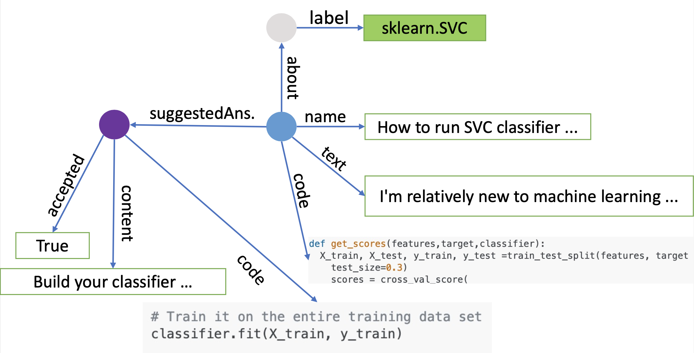
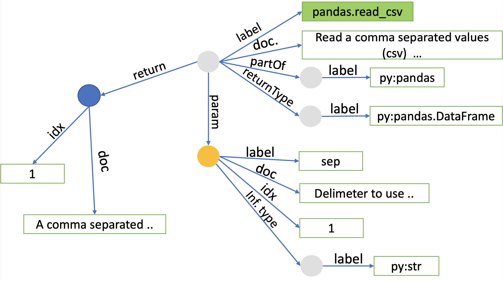

Knowledge graphs have been proven extremely useful in powering diverse applications in semantic search and natural language understanding.
In this work, we present GraphGen4Code, a toolkit to build code knowledge graphs that can similarly power various applications such as program search, code understanding, bug detection, and code automation. GraphGen4Code uses generic techniques to capture code semantics with the key nodes in the graph representing classes, functions and methods. Edges indicate function usage (e.g., how data flows through function calls, as derived from program analysis of real code), and documentation about functions (e.g., code documentation, usage documentation, or forum discussions such as StackOverflow). Our toolkit uses named graphs in RDF to model graphs per program, or can output graphs as JSON. We show the scalability of the toolkit by applying it to 1.3 million Python files drawn from GitHub, 2,300 Python modules, and 47 million forum posts. This results in an integrated code graph with over 2 billion triples. We make the toolkit to build such graphs as well as the sample extraction of the 2 billion triples graph publicly available to the community for use.

* Paper: [https://arxiv.org/abs/2002.09440](https://arxiv.org/abs/2002.09440)<br>
* Download Graph4CodeGen dataset as nquads from [here](https://archive.org/download/graph4codev1).


### Table of Contents
1. [Deploying and using Graph4Code](#deploy)
2. [Graph4CodeGen Pipeline](#pipeline)
4. [Schema](#schema)
5. [Create your own graph](./../README.md#create-your-own-graph) 
6. [Example Queries](./example_queries.md)
7. [Example Use Cases](./use_cases.md)
    * [Recommendation engine for developers](./use_cases.md#case1)
    * [Enforcing best practices](./use_cases.md#case2)  
    * [Learning from big code](./use_cases.md#case3) 
8. [Publications](#papers)

### Sample Graph Generated by Graph4CodeGen <a name="deploy"></a>
To demonstrate Graph4CodeGen's scalability, we build graphs for 1.3 million Python programs (where program refers to a single Python script) on GitHub, each analyzed into its own separate graph.  We also use the toolkit to link library calls to documentation and forum discussions, by identifying the most commonly used modules in code, and trying to connect their classes, methods or functions to relevant documentation or posts.  For forum posts, we used information retrieval techniques to connect it to its relevant methods or classes.  We performed this linking for 257K classes, 5.8M methods, and 278K functions, and processed 47M posts from StackOverflow and StackExchange. This shows the feasibility of using the Graph4CodeGen toolkit for building large-scale knowledge graphs for code that captures code semantics as well as natural language artifcacts about code.  

All graph files are available [here](https://archive.org/download/graph4codev1). 

To load and query this data, please follow the instructions [here](https://github.com/wala/graph4code/blob/master/docs/load_graph.md). We also provide scripts for creating a docker image with the graph database ready to use. 

### Graph4CodeGen Pipeline<a name="pipeline"></a>

The figure below shows the overall pipeline of steps followed by Graph4CodeGen to generate large-scale code knowledge graphs. 

<!----->
<p align="center">

</p>
<br><br>

   
### Schema<a name="schema"></a>

The following shows a code snippet example as well as a _high level overview_ of the information generated by Graph4CodeGen from code analysis, StackOverflow, and docstrings. We provide a random sample of each data source in _RDF_ format [here](https://github.com/wala/graph4code/tree/master/sample_graph). 


<!----->
<p align="center">

</p><p align="center">Code Snippet Example</p>
<br><br>

<!----->
<p align="center">

</p><p align="center">Dataflow graph for the running example</p>
<br><br>


<!----->
<p align="center">

</p><p align="center">StackOverflow Graph Example</p>
<br><br>


<!----->
<p align="center">

</p><p align="center">Docstrings Graph Example</p>
<br><br>


### Publications<a name="papers"></a>
* If you use Graph4Code in your research, please cite our work:

 ```
  @article{abdelaziz2020codebreaker,
  title={A Demonstration of CodeBreaker: A Machine Interpretable Knowledge Graph for Code},
  author={Abdelaziz, Ibrahim and Srinivas, Kavitha and Dolby, Julian and  McCusker, James P},
  journal={International Semantic Web Conference (ISWC) (Demonstration Track)},
  year={2020}
}
 @article{abdelaziz2020graph4code,
  title={Graph4Code: A Machine Interpretable Knowledge Graph for Code},
  author={Abdelaziz, Ibrahim and Dolby, Julian and  McCusker, James P and Srinivas, Kavitha},
  journal={arXiv preprint arXiv:2002.09440},
  year={2020}
}
```


