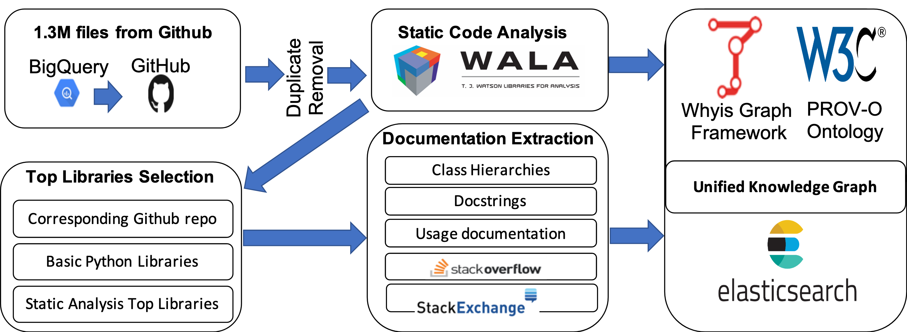

Knowledge graphs have proven extremely useful in powering diverse applications in semantic search and natural language understanding. Graph4Code is a knowledge graph about program code that can similarly power diverse applications such as program search, code understanding, refactoring, bug detection, and code automation.  The graph uses generic techniques to capture the semantics of Python code: the key nodes in the graph are classes, functions and methods in popular Python modules.  Edges indicate function usage (e.g., how data flows through function calls, as derived from program analysis of real code), and documentation about functions (e.g., code documentation, usage documentation, or forum discussions such as StackOverflow).  We make extensive use of named graphs in RDF to make the knowledge graph extensible by the community.  We describe a set of generic extraction techniques that we applied to over 1.3M Python files drawn from GitHub, over 2,300 Python modules, as well as 47M forum posts to generate a graph with over 2 billion triples. We also provide a number of initial use cases of the knowledge graph in code assistance, enforcing best practices, debugging and type inference. The graph and all its artifacts are available to the community for use. 

Download Graph4Code dataset as nquads [here](https://archive.org/download/graph4codev1).


### Table of Contents
1. [How Graph4Code is created?](#pipeline)
2. [Schema and Query By Example](#schema)
3. [Example Use Cases](./use_cases.md#uses)
    * [Recommendation engine for developers](./use_cases.md#case1)
    * [Enforcing best practices](./use_cases.md#case2)  
    * [Learning from big code](./use_cases.md#case3) 
4. [Publications](#papers)

### How Graph4Code is created?<a name="pipeline"></a>

<!----->
<p align="center">

</p>
<br><br>

### Schema and Example Queries:

The following shows a concept map of Graph4Code's overall schema, across the code analysis, Stack Exchange, and Docstrings extractions.

<p align="center">

</p>
<br><br>

#### Query Example 1: Get documentation about a function

The first example query returns the documentation of a class or function, in this case \texttt{pandas.read\_csv}. It also returns parameter and return types, when known. One can expand these parameters (\texttt{?param}) further to get their labels, documentation, inferred types, and check if they are optional.

```
select ?doc ?param ?return where {
   graph <http://purl.org/twc/graph4code/docstrings> {
      ?s  rdfs:label "pandas.read_csv" ;
          skos:definition ?doc .
      optional { ?s g4c:param ?param . }
      optional { ?s g4c:return ?return . }
    }
}
```
#### Query Example 2: Search in forums posts for program code

This query below assumes that the user has a context in the program from which they are launching their search. ?f specifies a list of functions that represent the calling context. 

```
select ?q ?t ?q_content ?a_content ?c where {
   graph <https://stackoverflow.com/questions/> {
     {
        # gather questions that are about the list of functions, counting the number of hits to functions
        # per question.  Here we used values to specify that list as ?f
        select ?q (count(?q) as ?c) {
            values (?f) {
              (python:sklearn.model_selection.train_test_split)
              (python:sklearn.svm.SVC.fit)
            }
           ?q rdf:type  schema:Question;
              schema:about ?f ;

       } group by ?q
     }
        # gather the content and title of the question, its suggested answers and their content
        # ensuring the answer contains some phrase
       ?q schema:suggestedAnswer ?a ;
            sioc:content  ?q_content ;
            schema:name ?t.
       ?a rdf:type schema:Answer ;
            sioc:content ?a_content .
       filter(contains(?a_content, "memory issue"))
   }
} order by desc(?c)
```

#### Example 3: Understand how people use functions or classes

Another use of Graph4Code is to understand how people use functions such as *pandas.read\_csv*. In particular, the query below shows when *pandas.read\_csv* is used, what are the *fit* functions that are typically applied on its output. 


```
select distinct ?label where {
   graph ?g {
        ?read rdfs:label "pandas.read_csv" .
        ?fit schema:about "fit" .
        ?read graph4code:flowsTo+ ?fit .
        ?fit rdfs:label ?label .
   }
}
```

### Publications<a name="papers"></a>
* If you use [Graph4Code](https://arxiv.org/abs/2002.09440) in your research, please cite our paper:

 ```
 @article{srinivas2020graph4code,
  title={Graph4Code: A Machine Interpretable Knowledge Graph for Code},
  author={Abdelaziz, Ibrahim and Dolby, Julian and  McCusker, James P and Srinivas, Kavitha},
  journal={arXiv preprint arXiv:2002.09440},
  year={2020}
}
```

